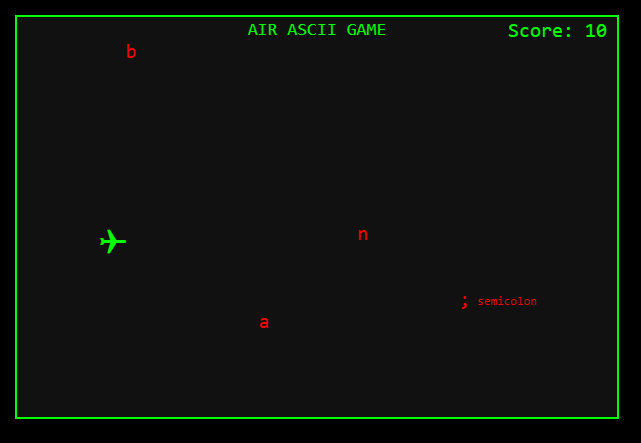

# ✈️ AIR ASCII Airplane Game

A fun little ASCII-style browser game where you control an airplane (`✈`) and dodge falling ASCII symbols. Built using HTML5 Canvas and JavaScript.



---

## 🎮 Gameplay

- Use **arrow keys** to move the airplane in any direction (left, right, up, down).
- Press **spacebar** to increase speed.
- Avoid falling ASCII characters like `/`, `@`, `#`, etc.
- Each character also displays its **name** (e.g., `slash`, `at`, `hash`).
- Your score increases the longer you survive.

---

## 🧠 Educational Value

This game is not just for fun — it's also a great tool for **learning and memorizing ASCII characters** and their names!

As you play:
- Each falling character shows its **symbol** and **text name**
- Helps improve symbol recognition, memory, and typing reflex

Perfect for:
- Programming beginners  
- Kids learning keyboard symbols  
- Anyone training their reflexes & memory!

---

## 🧩 Features

- Retro-style design using monospace ASCII characters
- Responsive airplane controls using arrow keys and space
- Randomized ASCII obstacles with labels
- Real-time scoring
- Centered title (`AIR ASCII GAME`) and score shown on screen
- Game over screen with restart option

---

## 🖥️ Run Locally

### 1. Clone or download this repository

```bash
git clone https://github.com/sjat02/airascii

