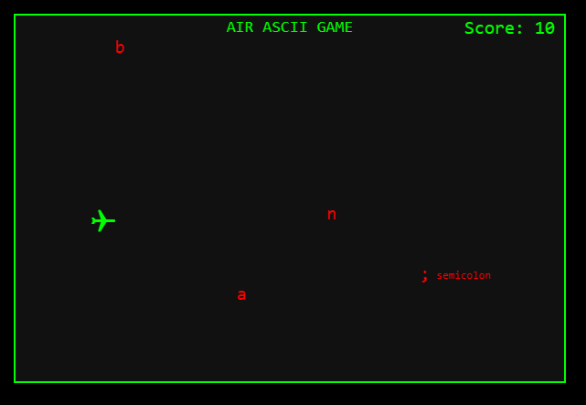

# AIR ASCII Airplane Game

A fun retro ASCII-style browser game where you control an airplane (`✈`) and dodge falling ASCII symbols with **alphabet-touch Game Over** and a **points system based on rarity**.



---

## Gameplay

- Use **arrow keys** to move the airplane in any direction (left, right, up, down).
- Press **spacebar** to temporarily increase speed.
- Avoid **falling ASCII characters** like `/`, `@`, `#`, etc.
- If you touch an **alphabet** (A–Z / a–z), the game ends instantly.
- Survive as long as possible to increase your score.
- **Press SPACE after Game Over** to restart instantly.

---

## Educational Value

Not just fun — it's also a great tool for **learning and memorizing ASCII characters** and their names!

As you play:
- Each falling character shows both its **symbol** and **text name**.
- Helps improve **symbol recognition**, **memory**, and **typing reflex**.

Perfect for:
- Programming beginners  
- Kids learning keyboard symbols  
- Anyone training reflexes & memory

---

## Features

- Retro-style design using monospace ASCII characters
- Responsive controls with arrow keys + space for speed boost
- Randomized ASCII obstacles with labels
- **Alphabet-touch instant Game Over**
- **Points system based on symbol rarity**:
  - Rare symbols like `@`, `#`, `$`, `%`, etc. → **+10 points**
  - Medium rarity symbols like `/`, `?`, `=` → **+8 points**
  - Common punctuation like `-`, `_`, `:` → **+6 points**
  - Very common symbols like `.` or `,` → **+4 points**
  - All other symbols → **+2 points**
- Real-time score display
- Game Over screen with **spacebar restart**

---

## Run Locally

### 1. Clone or download this repository
```bash
git clone https://github.com/sjat02/airascii
